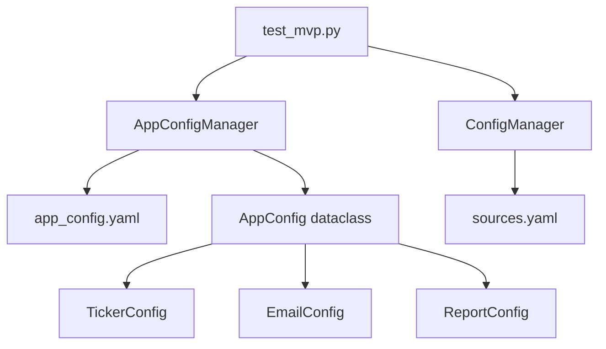

# Design Document: Config File Inputs

## Overview

This design extends the existing `ConfigManager` to support a new `app_config.yaml` file for user-configurable inputs. The implementation adds dataclasses for application configuration (tickers, email, report settings) and extends the existing config module with a new `AppConfigManager` class.

The design follows the existing patterns in `config.py` - using dataclasses for configuration models and YAML for storage.

## Architecture



The `AppConfigManager` is a separate class from the existing `ConfigManager` to maintain single responsibility. The MVP script loads both configs as needed.

## Components and Interfaces

### AppConfigManager

Extends the config module with application configuration loading:

```python
@dataclass
class AppConfigManager:
    config_path: Path
    _config: AppConfig | None = None

    def load(self) -> AppConfig:
        """Load and validate app configuration from YAML file."""
        
    def validate(self, config: dict[str, Any]) -> list[str]:
        """Return list of validation errors (empty if valid)."""
```

### Configuration Dataclasses

```python
@dataclass
class TickerConfig:
    symbols: list[str]  # Normalized to uppercase

@dataclass  
class EmailConfig:
    enabled: bool
    smtp_host: str | None
    smtp_port: int | None
    smtp_username: str | None
    smtp_password_env: str | None  # Environment variable name
    from_email: str | None
    to_emails: list[str]
    use_tls: bool

@dataclass
class ReportConfig:
    format: str  # "html" or "text"
    include_news: bool
    include_earnings: bool
    include_macro: bool
    save_to_file: bool
    output_directory: str | None

@dataclass
class AppConfig:
    tickers: TickerConfig
    email: EmailConfig
    report: ReportConfig
```

## Data Models

### app_config.yaml Structure

```yaml
tickers:
  - AAPL
  - MSFT
  - GOOGL

email:
  enabled: false
  smtp_host: smtp.gmail.com
  smtp_port: 587
  smtp_username: user@example.com
  smtp_password_env: SMTP_PASSWORD
  from_email: trading-copilot@example.com
  to_emails:
    - recipient@example.com
  use_tls: true

report:
  format: html
  include_news: true
  include_earnings: true
  include_macro: true
  save_to_file: false
  output_directory: ./reports
```

### Validation Rules

| Field | Validation |
|-------|------------|
| tickers | Required, non-empty list, alphanumeric symbols only |
| email.enabled | Required boolean |
| email.smtp_* | Required when email.enabled=true |
| email.to_emails | Valid email format when email.enabled=true |
| report.format | Must be "html" or "text" |
| report.output_directory | Required when save_to_file=true |


## Correctness Properties

*A property is a characteristic or behavior that should hold true across all valid executions of a system—essentially, a formal statement about what the system should do. Properties serve as the bridge between human-readable specifications and machine-verifiable correctness guarantees.*

### Property 1: Ticker Normalization

*For any* valid ticker string (alphanumeric, 1-5 characters), parsing the ticker SHALL produce an uppercase normalized version.

**Validates: Requirements 2.1, 2.5**

### Property 2: Configuration Round-Trip

*For any* valid `AppConfig` object, serializing to YAML then deserializing SHALL produce an equivalent configuration.

**Validates: Requirements 2.6**

### Property 3: Invalid Ticker Rejection

*For any* string containing non-alphanumeric characters or exceeding 5 characters, validation SHALL reject with a ConfigurationError.

**Validates: Requirements 2.4**

### Property 4: Invalid Email Format Rejection

*For any* string that does not match a valid email pattern (missing @, invalid domain), validation SHALL reject with a ConfigurationError when email is enabled.

**Validates: Requirements 3.4**

### Property 5: Conditional Email Validation

*For any* configuration with `email.enabled=false`, validation SHALL succeed regardless of SMTP field values (missing or invalid).

**Validates: Requirements 3.6**

### Property 6: Error Aggregation

*For any* configuration with multiple validation errors, the ConfigurationError SHALL contain all error messages, not just the first.

**Validates: Requirements 5.2**

## Error Handling

| Error Condition | Exception | Message Format |
|-----------------|-----------|----------------|
| Config file not found | ConfigurationError | "Config file not found: {path}" |
| Invalid YAML syntax | ConfigurationError | "Invalid YAML in config file: {details}" |
| Missing required field | ConfigurationError | "Missing required field: {field}" |
| Invalid ticker format | ConfigurationError | "Invalid ticker symbol: {ticker}" |
| Invalid email format | ConfigurationError | "Invalid email address: {email}" |
| Invalid report format | ConfigurationError | "Invalid report format: {format}. Must be 'html' or 'text'" |
| Missing env variable | Warning (logged) | "Environment variable not set: {var}" |

## Testing Strategy

### Unit Tests
- Test loading valid config file
- Test error cases: missing file, invalid YAML, missing required fields
- Test ticker validation edge cases
- Test email validation when enabled vs disabled
- Test default value application

### Property-Based Tests
Use `hypothesis` library for property-based testing with minimum 100 iterations per property.

Each property test should be tagged with:
```python
# Feature: config-file-inputs, Property N: <property description>
```

Property tests to implement:
1. Ticker normalization (generate random valid ticker strings)
2. Round-trip serialization (generate random valid AppConfig objects)
3. Invalid ticker rejection (generate strings with special characters)
4. Invalid email rejection (generate malformed email strings)
5. Conditional email validation (generate configs with enabled=false)
6. Error aggregation (generate configs with multiple errors)
