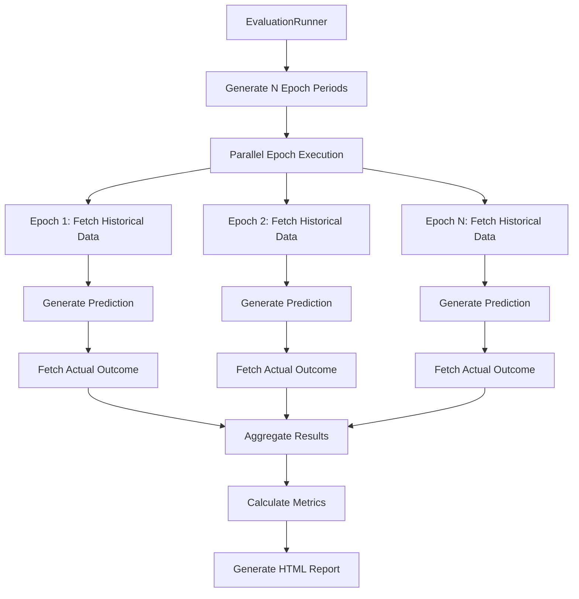
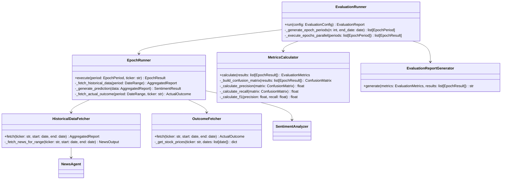

# Design Document: Evaluation Module

## Overview

The Evaluation Module provides backtesting capabilities for the Trading Copilot's sentiment predictions. It retrieves historical news data, generates sentiment predictions using the existing `SentimentAnalyzer`, and validates those predictions against actual stock price movements. The module supports running multiple non-overlapping evaluation epochs in parallel to gather statistically meaningful performance metrics.

### Key Design Goals

1. **Reuse existing components**: Leverage `SentimentAnalyzer`, `NewsAgent`, and `HTMLReportGenerator`
2. **Non-overlapping epochs**: Ensure evaluation periods don't share data to maintain statistical independence
3. **Parallel execution**: Support concurrent epoch evaluation for efficiency
4. **Graceful degradation**: Handle missing data and partial failures without crashing

### High-Level Flow



## Architecture

The Evaluation Module follows a layered architecture that integrates with existing Trading Copilot components:



### Component Responsibilities

| Component | Responsibility |
|-----------|----------------|
| `EvaluationRunner` | Orchestrates the full evaluation: generates epoch periods, executes epochs in parallel, aggregates results |
| `EpochRunner` | Executes a single epoch: fetches historical data, generates prediction, determines actual outcome |
| `HistoricalDataFetcher` | Retrieves news data for a specified date range using existing `NewsAgent` |
| `OutcomeFetcher` | Retrieves stock price data to determine bullish/bearish outcome |
| `MetricsCalculator` | Computes precision, recall, F1-score, accuracy, and confusion matrix |
| `EvaluationReportGenerator` | Generates HTML report with metrics and per-epoch details |

## Components and Interfaces

### EvaluationRunner

The main entry point for running evaluations.

```python
class EvaluationRunner:
    """Orchestrates multi-epoch evaluation of sentiment predictions."""
    
    def __init__(
        self,
        epoch_runner: EpochRunner,
        metrics_calculator: MetricsCalculator,
        report_generator: EvaluationReportGenerator,
        max_parallelism: int = 4,
    ):
        """Initialize with dependencies."""
        
    async def run(self, config: EvaluationConfig) -> EvaluationReport:
        """
        Execute evaluation across N epochs.
        
        Args:
            config: Evaluation configuration with ticker, epoch count, etc.
            
        Returns:
            EvaluationReport with metrics and per-epoch results
        """
        
    def _generate_epoch_periods(
        self, 
        n: int, 
        end_date: date,
    ) -> list[EpochPeriod]:
        """
        Generate N non-overlapping epoch periods working backwards from end_date.
        
        Each epoch consists of:
        - 2-week look-back period (Sunday to Saturday)
        - 1-week prediction period (Sunday to Saturday)
        
        Epochs are arranged so prediction periods don't overlap with any look-back periods.
        """
```

### EpochRunner

Executes a single evaluation epoch.

```python
class EpochRunner:
    """Executes a single epoch evaluation."""
    
    def __init__(
        self,
        historical_fetcher: HistoricalDataFetcher,
        outcome_fetcher: OutcomeFetcher,
        sentiment_analyzer: SentimentAnalyzer,
    ):
        """Initialize with dependencies."""
        
    async def execute(
        self, 
        period: EpochPeriod, 
        ticker: str,
    ) -> EpochResult:
        """
        Execute single epoch evaluation.
        
        1. Fetch historical data for look-back period
        2. Generate sentiment prediction
        3. Fetch actual outcome for prediction period
        4. Compare prediction vs actual
        
        Returns:
            EpochResult with prediction, actual, and match status
        """
```

### HistoricalDataFetcher

Retrieves historical news data for a date range.

```python
class HistoricalDataFetcher:
    """Fetches historical news data for backtesting."""
    
    def __init__(self, news_agent: NewsAgent):
        """Initialize with news agent."""
        
    async def fetch(
        self, 
        ticker: str, 
        start_date: date, 
        end_date: date,
    ) -> AggregatedReport:
        """
        Fetch news articles published within the date range.
        
        Args:
            ticker: Stock ticker symbol
            start_date: Start of look-back period (inclusive)
            end_date: End of look-back period (inclusive)
            
        Returns:
            AggregatedReport with news data for the period
        """
```

### OutcomeFetcher

Determines actual stock price movement.

```python
class OutcomeFetcher:
    """Fetches actual stock price outcomes for validation."""
    
    async def fetch(
        self, 
        ticker: str, 
        start_date: date, 
        end_date: date,
    ) -> ActualOutcome:
        """
        Determine if stock was bullish or bearish during the period.
        
        Bullish: closing price on end_date > opening price on start_date
        Bearish: closing price on end_date <= opening price on start_date
        
        Args:
            ticker: Stock ticker symbol
            start_date: First day of prediction period (Sunday)
            end_date: Last day of prediction period (Saturday)
            
        Returns:
            ActualOutcome with direction and price data
        """
```

### MetricsCalculator

Computes evaluation metrics.

```python
class MetricsCalculator:
    """Calculates classification metrics from epoch results."""
    
    def calculate(self, results: list[EpochResult]) -> EvaluationMetrics:
        """
        Compute precision, recall, F1, accuracy, and confusion matrix.
        
        Args:
            results: List of completed epoch results
            
        Returns:
            EvaluationMetrics with all computed metrics
            
        Raises:
            InsufficientDataError: If fewer than 2 completed epochs
        """
```

### EvaluationReportGenerator

Generates HTML evaluation reports.

```python
class EvaluationReportGenerator:
    """Generates HTML reports for evaluation results."""
    
    def generate(
        self, 
        metrics: EvaluationMetrics, 
        results: list[EpochResult],
        config: EvaluationConfig,
    ) -> str:
        """
        Generate HTML report with metrics summary and per-epoch details.
        
        Returns:
            HTML string for the evaluation report
        """
```

## Data Models

### Configuration Models

```python
@dataclass
class EvaluationConfig:
    """Configuration for running an evaluation."""
    ticker: str                    # Stock ticker to evaluate
    num_epochs: int = 10           # Number of epochs (1-52)
    max_parallelism: int = 4       # Max concurrent epoch executions
    
    def __post_init__(self):
        if not 1 <= self.num_epochs <= 52:
            raise ConfigurationError("num_epochs must be between 1 and 52")
        if self.max_parallelism < 1:
            raise ConfigurationError("max_parallelism must be at least 1")
```

### Period Models

```python
@dataclass
class DateRange:
    """A date range with start and end dates."""
    start: date  # Inclusive
    end: date    # Inclusive
    
    def __post_init__(self):
        if self.start > self.end:
            raise ValueError("start must be <= end")


@dataclass
class EpochPeriod:
    """Defines the time periods for a single evaluation epoch."""
    epoch_number: int
    look_back: DateRange   # 2-week period for gathering sentiment data
    prediction: DateRange  # 1-week period for prediction validation
```

### Result Models

```python
class EpochStatus(Enum):
    """Status of an epoch evaluation."""
    COMPLETE = "complete"
    NO_DATA = "no_data"           # No historical data available
    INCOMPLETE = "incomplete"     # Missing price data for outcome
    FAILED = "failed"             # Execution error


@dataclass
class ActualOutcome:
    """Actual stock price movement during prediction period."""
    direction: Sentiment          # BULLISH or BEARISH
    open_price: float            # Opening price on first day
    close_price: float           # Closing price on last day
    price_change_pct: float      # Percentage change


@dataclass
class EpochResult:
    """Result of a single epoch evaluation."""
    epoch_number: int
    period: EpochPeriod
    status: EpochStatus
    predicted_sentiment: Sentiment | None
    predicted_confidence: ConfidenceLevel | None
    actual_outcome: ActualOutcome | None
    is_correct: bool | None       # True if prediction matches actual
    execution_duration_ms: int
    error_message: str | None = None
```

### Metrics Models

```python
@dataclass
class ConfusionMatrix:
    """2x2 confusion matrix for binary classification."""
    true_positive: int   # Predicted bullish, actual bullish
    false_positive: int  # Predicted bullish, actual bearish
    true_negative: int   # Predicted bearish, actual bearish
    false_negative: int  # Predicted bearish, actual bullish


@dataclass
class EvaluationMetrics:
    """Computed metrics from evaluation results."""
    precision: float              # TP / (TP + FP)
    recall: float                 # TP / (TP + FN)
    f1_score: float              # 2 * (precision * recall) / (precision + recall)
    accuracy: float              # (TP + TN) / total
    confusion_matrix: ConfusionMatrix
    total_epochs: int
    completed_epochs: int
    warning: str | None = None   # e.g., "insufficient_data"


@dataclass
class EvaluationReport:
    """Complete evaluation report."""
    ticker: str
    config: EvaluationConfig
    metrics: EvaluationMetrics
    epoch_results: list[EpochResult]
    generated_at: datetime
    html_content: str
```


## Correctness Properties

*A property is a characteristic or behavior that should hold true across all valid executions of a system—essentially, a formal statement about what the system should do. Properties serve as the bridge between human-readable specifications and machine-verifiable correctness guarantees.*

### Property 1: Date Range Filtering

*For any* date range specified to the HistoricalDataFetcher, all returned news articles SHALL have `published_at` timestamps that fall within the specified start and end dates (inclusive), regardless of whether the range spans week boundaries.

**Validates: Requirements 1.1, 1.5**

### Property 2: UTC Timestamp Normalization

*For any* news article returned by the HistoricalDataFetcher, the `published_at` timestamp SHALL be in UTC timezone.

**Validates: Requirements 1.4**

### Property 3: Prediction Output Completeness

*For any* valid historical data input provided to the Evaluation Module, the generated prediction SHALL contain:
- A sentiment value (BULLISH or BEARISH)
- A confidence level (HIGH, MEDIUM, or LOW)
- A prediction timestamp
- The look-back period dates used

**Validates: Requirements 2.1, 2.3, 2.4**

### Property 4: Bullish/Bearish Classification Correctness

*For any* pair of opening and closing prices, the classification SHALL be BULLISH if and only if `close_price > open_price`, and BEARISH otherwise (when `close_price <= open_price`).

**Validates: Requirements 3.2, 3.3**

### Property 5: Epoch Result Completeness

*For any* completed epoch execution, the EpochResult SHALL contain:
- The predicted sentiment and confidence
- The actual outcome (direction and prices)
- A boolean `is_correct` indicating match status
- A non-negative `execution_duration_ms` value

**Validates: Requirements 4.4, 4.5**

### Property 6: Non-Overlapping Epoch Periods

*For any* N epochs generated by the Evaluation Module:
1. No two look-back periods SHALL overlap with each other
2. No prediction period SHALL overlap with any look-back period (to prevent data leakage)
3. Epochs SHALL be arranged chronologically working backwards from the end date

**Validates: Requirements 5.1**

### Property 7: Result Aggregation Count

*For any* evaluation run requesting N epochs, the aggregated results SHALL contain exactly N EpochResult entries (regardless of individual epoch success/failure status).

**Validates: Requirements 5.3**

### Property 8: Fault Tolerance

*For any* evaluation run where K out of N epochs fail (where K < N), the remaining N-K epochs SHALL complete successfully and their results SHALL be included in the final report.

**Validates: Requirements 5.4**

### Property 9: Epoch Count Validation

*For any* epoch count N provided in configuration:
- If N is in range [1, 52], the configuration SHALL be accepted
- If N is outside range [1, 52], a ConfigurationError SHALL be raised

**Validates: Requirements 5.5**

### Property 10: Metrics Calculation Correctness

*For any* set of completed epoch results with confusion matrix values (TP, FP, TN, FN):
- Precision SHALL equal `TP / (TP + FP)` (or 0 if TP + FP = 0)
- Recall SHALL equal `TP / (TP + FN)` (or 0 if TP + FN = 0)
- F1 Score SHALL equal `2 * (precision * recall) / (precision + recall)` (or 0 if both are 0)
- Accuracy SHALL equal `(TP + TN) / (TP + FP + TN + FN)`
- Confusion matrix values SHALL sum to the total number of completed epochs

**Validates: Requirements 6.1, 6.2, 6.3, 6.4, 6.5**

### Property 11: Report Content Completeness

*For any* generated evaluation report:
- The HTML SHALL be valid and well-formed
- The report SHALL contain all computed metrics (precision, recall, F1, accuracy)
- The report SHALL contain per-epoch details with prediction, actual outcome, and correctness
- The report SHALL contain date ranges for each epoch
- The report SHALL contain a summary section with overall accuracy and confidence breakdown

**Validates: Requirements 7.1, 7.2, 7.3, 7.4, 7.5**

### Property 12: Configuration Validation

*For any* invalid configuration input (e.g., invalid ticker format, out-of-range epoch count, negative parallelism), the Evaluation Module SHALL raise a ConfigurationError with a descriptive message explaining the validation failure.

**Validates: Requirements 8.4**

## Error Handling

### Error Types

```python
class EvaluationError(Exception):
    """Base exception for evaluation module errors."""
    pass


class ConfigurationError(EvaluationError):
    """Raised when evaluation configuration is invalid."""
    pass


class HistoricalDataError(EvaluationError):
    """Raised when historical data retrieval fails."""
    pass


class OutcomeFetchError(EvaluationError):
    """Raised when stock price data cannot be retrieved."""
    pass


class InsufficientDataError(EvaluationError):
    """Raised when there's not enough data for meaningful metrics."""
    pass
```

### Error Handling Strategy

| Scenario | Handling |
|----------|----------|
| Invalid configuration | Raise `ConfigurationError` immediately, do not proceed |
| No historical data for epoch | Mark epoch as `NO_DATA`, continue with other epochs |
| Missing stock price data | Mark epoch as `INCOMPLETE`, exclude from metrics |
| Epoch execution failure | Mark epoch as `FAILED`, log error, continue with others |
| All epochs fail | Return report with empty metrics and error summary |
| Fewer than 2 completed epochs | Return metrics with `insufficient_data` warning |
| Network timeout | Retry up to 3 times with exponential backoff |

### Graceful Degradation

The module prioritizes completing as many epochs as possible:

1. Individual epoch failures don't stop the evaluation
2. Partial results are always returned
3. Metrics are computed only from completed epochs
4. Reports clearly indicate which epochs failed and why

## Testing Strategy

### Dual Testing Approach

The Evaluation Module requires both unit tests and property-based tests for comprehensive coverage:

- **Unit tests**: Verify specific examples, edge cases, and error conditions
- **Property tests**: Verify universal properties across randomly generated inputs

### Property-Based Testing Configuration

- **Library**: `hypothesis` (Python's standard PBT library)
- **Minimum iterations**: 100 per property test
- **Tag format**: `Feature: evaluation-module, Property {number}: {property_text}`

### Property Test Implementations

| Property | Test Strategy |
|----------|---------------|
| P1: Date Range Filtering | Generate random date ranges, verify all returned articles fall within range |
| P2: UTC Normalization | Generate articles with various timezones, verify output is UTC |
| P3: Prediction Completeness | Generate random AggregatedReports, verify all output fields present |
| P4: Classification | Generate random price pairs, verify classification matches formula |
| P5: Epoch Result Completeness | Generate random epoch executions, verify all fields populated |
| P6: Non-Overlapping Epochs | Generate N in [1, 52], verify no period overlaps |
| P7: Aggregation Count | Generate N epochs with random failures, verify result count = N |
| P8: Fault Tolerance | Inject failures in K epochs, verify N-K complete |
| P9: Epoch Count Validation | Generate N values, verify acceptance/rejection |
| P10: Metrics Calculation | Generate confusion matrices, verify formulas |
| P11: Report Completeness | Generate evaluation results, verify HTML contains required sections |
| P12: Config Validation | Generate invalid configs, verify ConfigurationError raised |

### Unit Test Coverage

Unit tests focus on:

1. **Edge cases**:
   - Empty historical data (no articles)
   - Single epoch evaluation
   - All epochs fail
   - Exactly 2 completed epochs (minimum for metrics)
   - Price unchanged (close == open, should be bearish)

2. **Integration points**:
   - HistoricalDataFetcher correctly calls NewsAgent
   - EpochRunner correctly orchestrates components
   - EvaluationRunner correctly parallelizes execution

3. **Error conditions**:
   - Invalid ticker format
   - Network failures
   - Malformed API responses

### Test File Structure

```
trading_copilot/tests/
├── test_evaluation_runner.py          # Unit tests for EvaluationRunner
├── test_epoch_runner.py               # Unit tests for EpochRunner
├── test_historical_data_fetcher.py    # Unit tests for HistoricalDataFetcher
├── test_outcome_fetcher.py            # Unit tests for OutcomeFetcher
├── test_metrics_calculator.py         # Unit tests for MetricsCalculator
├── test_evaluation_report.py          # Unit tests for report generation
├── test_evaluation_properties.py      # Property-based tests for all properties
└── test_evaluation_integration.py     # Integration tests
```

### Example Property Test

```python
from hypothesis import given, strategies as st, settings

@settings(max_examples=100)
@given(
    tp=st.integers(min_value=0, max_value=50),
    fp=st.integers(min_value=0, max_value=50),
    tn=st.integers(min_value=0, max_value=50),
    fn=st.integers(min_value=0, max_value=50),
)
def test_metrics_calculation_correctness(tp, fp, tn, fn):
    """
    Feature: evaluation-module, Property 10: Metrics Calculation Correctness
    
    For any confusion matrix, metrics are computed according to formulas.
    """
    matrix = ConfusionMatrix(
        true_positive=tp,
        false_positive=fp,
        true_negative=tn,
        false_negative=fn,
    )
    
    results = _create_epoch_results_from_matrix(matrix)
    metrics = MetricsCalculator().calculate(results)
    
    # Verify precision
    expected_precision = tp / (tp + fp) if (tp + fp) > 0 else 0.0
    assert abs(metrics.precision - expected_precision) < 1e-9
    
    # Verify recall
    expected_recall = tp / (tp + fn) if (tp + fn) > 0 else 0.0
    assert abs(metrics.recall - expected_recall) < 1e-9
    
    # Verify F1
    if expected_precision + expected_recall > 0:
        expected_f1 = 2 * (expected_precision * expected_recall) / (expected_precision + expected_recall)
    else:
        expected_f1 = 0.0
    assert abs(metrics.f1_score - expected_f1) < 1e-9
    
    # Verify accuracy
    total = tp + fp + tn + fn
    expected_accuracy = (tp + tn) / total if total > 0 else 0.0
    assert abs(metrics.accuracy - expected_accuracy) < 1e-9
    
    # Verify confusion matrix sum
    assert (
        metrics.confusion_matrix.true_positive +
        metrics.confusion_matrix.false_positive +
        metrics.confusion_matrix.true_negative +
        metrics.confusion_matrix.false_negative
    ) == total
```
