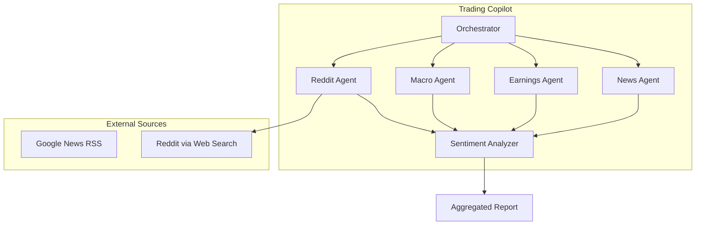
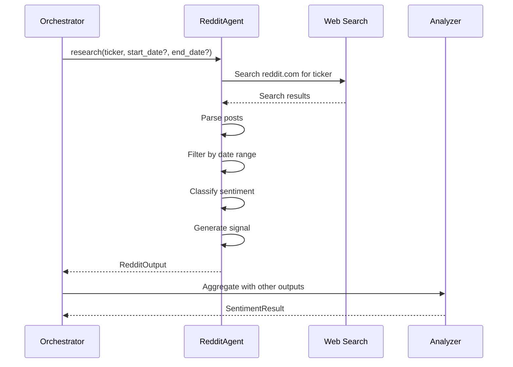

# Design Document: Reddit Sentiment Agent

## Overview

The Reddit Sentiment Agent extends the Trading Copilot's research capabilities by gathering and analyzing retail investor sentiment from Reddit discussions. It follows the established ResearchAgent pattern, retrieving posts from investing-focused subreddits, classifying sentiment using Reddit-specific keywords and engagement metrics, and generating signals that integrate with the existing sentiment analysis pipeline.

The agent uses web search as the primary data retrieval mechanism (searching `site:reddit.com/r/{subreddit}` via RSS feeds), with support for historical date ranges to enable evaluation backtesting. This design prioritizes:

- **Consistency**: Following the NewsAgent pattern for architecture and interface
- **Eval-Driven Development**: Supporting historical data retrieval for backtesting
- **Graceful Degradation**: Failing without blocking other agents
- **Signal Quality**: Weighting sentiment by engagement metrics

## Architecture



### Component Interaction Flow



## Components and Interfaces

### RedditAgent Class

```python
class RedditAgent(ResearchAgent):
    """Gathers sentiment from Reddit discussions."""
    
    def __init__(self, sources: list[SourceConfig]) -> None:
        """
        Initialize RedditAgent.
        
        Args:
            sources: List of Reddit data source configurations
        """
        pass
    
    def get_agent_type(self) -> AgentType:
        """Return AgentType.REDDIT."""
        pass
    
    async def research(
        self,
        ticker: str,
        start_date: date | None = None,
        end_date: date | None = None,
    ) -> RedditOutput:
        """
        Retrieve Reddit posts mentioning the ticker.
        
        Args:
            ticker: Validated stock ticker symbol
            start_date: Optional start date for filtering (inclusive)
            end_date: Optional end date for filtering (inclusive)
        
        Returns:
            RedditOutput with posts from relevant subreddits
        """
        pass
    
    async def _search_reddit(
        self,
        ticker: str,
        start_date: date | None = None,
        end_date: date | None = None,
    ) -> list[RedditPost]:
        """
        Search Reddit using web search with site:reddit.com filter.
        
        Searches across configured subreddits (wallstreetbets, stocks, 
        investing, StockMarket) and combines results.
        """
        pass
    
    def _categorize_sentiment(self, post: RedditPost) -> ArticleSentiment:
        """
        Classify Reddit post sentiment using Reddit-specific keywords.
        
        Positive: moon, rocket, tendies, calls, buy, long, bullish, gains
        Negative: crash, dump, puts, sell, short, bearish, loss, bagholding
        
        Also considers engagement: high score (>100) adds positive weight.
        """
        pass
    
    def _generate_signal(self, posts: list[RedditPost]) -> Signal | None:
        """
        Generate aggregated sentiment signal from posts.
        
        Direction: Majority sentiment across posts
        Strength: Weighted by engagement (score + comments)
        
        Returns None if no posts available.
        """
        pass
    
    async def close(self) -> None:
        """Close HTTP client."""
        pass
```

### RedditPost Data Class

```python
@dataclass
class RedditPost:
    """Represents a Reddit post about a stock."""
    
    title: str           # Post title
    subreddit: str       # Subreddit name (without r/)
    score: int           # Upvote score
    num_comments: int    # Number of comments
    url: str             # Direct link to Reddit post
    created_at: datetime # Post creation timestamp (UTC)
    snippet: str         # Post body snippet or description
    sentiment: ArticleSentiment = ArticleSentiment.NEUTRAL
```

### RedditOutput Data Class

```python
@dataclass
class RedditOutput:
    """Output from Reddit research."""
    
    ticker: str                    # Stock ticker analyzed
    posts: list[RedditPost]        # Retrieved posts
    retrieved_at: datetime         # When data was fetched (UTC)
    status: str                    # "success", "no_data", "error"
    data_source: str = "web_search"  # Data retrieval method
    error_message: str | None = None  # Error details if status="error"
    signal: Signal | None = None   # Aggregated sentiment signal
```

### Configuration Extension (sources.yaml)

```yaml
reddit_sources:
  - name: "Reddit Web Search"
    api_endpoint: "https://www.google.com/search"
    api_key_env: ""  # No API key needed for web search
    added_at: "2024-01-01T00:00:00"
    enabled: true
    subreddits:
      - wallstreetbets
      - stocks
      - investing
      - StockMarket
```

### Integration with Orchestrator

The Orchestrator will be updated to:
1. Instantiate RedditAgent alongside other agents
2. Call `reddit_agent.research(ticker, start_date, end_date)` concurrently
3. Include RedditOutput in AggregatedReport
4. Pass Reddit signal to Analyzer for sentiment synthesis

### Integration with Analyzer

The Analyzer will be updated to:
1. Accept RedditOutput in the aggregation
2. Include Reddit signal in signal weighting
3. Cite Reddit discussions in sentiment rationale
4. Handle missing Reddit data gracefully

### Integration with HTML Report

The HTML report generator will be updated to:
1. Add a "Reddit Sentiment" section
2. Display posts with titles as hyperlinks
3. Show subreddit, score, and sentiment for each post
4. Include Reddit in the executive summary if data available

## Data Models

### Existing Models (Reused)

- `ArticleSentiment`: POSITIVE, NEGATIVE, NEUTRAL - reused for post sentiment
- `Signal`: source, direction, strength, reasoning - reused for Reddit signal
- `AgentType`: Extended to include REDDIT (already exists)
- `SourceConfig`: Reused for Reddit source configuration

### New Models

```python
@dataclass
class RedditPost:
    """A Reddit post about a stock ticker."""
    title: str
    subreddit: str
    score: int
    num_comments: int
    url: str
    created_at: datetime
    snippet: str
    sentiment: ArticleSentiment = ArticleSentiment.NEUTRAL


@dataclass  
class RedditOutput:
    """Output from Reddit Agent research."""
    ticker: str
    posts: list[RedditPost]
    retrieved_at: datetime
    status: str  # "success", "no_data", "error"
    data_source: str = "web_search"
    error_message: str | None = None
    signal: Signal | None = None
```

### AggregatedReport Extension

```python
@dataclass
class AggregatedReport:
    ticker: str
    news: NewsOutput | None
    earnings: EarningsOutput | None
    macro: MacroOutput | None
    reddit: RedditOutput | None  # NEW: Reddit sentiment data
    aggregated_at: datetime
    missing_components: list[AgentType]
```

### Signal Generation Logic

```python
def _generate_signal(self, posts: list[RedditPost]) -> Signal | None:
    """
    Generate signal from Reddit posts.
    
    Algorithm:
    1. Count posts by sentiment (weighted by engagement)
    2. Direction = majority sentiment
    3. Strength = confidence based on agreement ratio
    """
    if not posts:
        return None
    
    # Weight by engagement (score + comments)
    weighted_positive = sum(
        (p.score + p.num_comments + 1) 
        for p in posts 
        if p.sentiment == ArticleSentiment.POSITIVE
    )
    weighted_negative = sum(
        (p.score + p.num_comments + 1) 
        for p in posts 
        if p.sentiment == ArticleSentiment.NEGATIVE
    )
    
    total_weight = weighted_positive + weighted_negative
    if total_weight == 0:
        return None
    
    # Direction based on weighted majority
    if weighted_positive > weighted_negative:
        direction = Sentiment.BULLISH
        strength = weighted_positive / total_weight
    else:
        direction = Sentiment.BEARISH
        strength = weighted_negative / total_weight
    
    return Signal(
        source=AgentType.REDDIT,
        direction=direction,
        strength=min(strength, 1.0),
        reasoning=f"Based on {len(posts)} Reddit posts"
    )
```


## Correctness Properties

*A property is a characteristic or behavior that should hold true across all valid executions of a system—essentially, a formal statement about what the system should do. Properties serve as the bridge between human-readable specifications and machine-verifiable correctness guarantees.*

### Property 1: Post Completeness

*For any* RedditPost in a RedditOutput with status "success", the post SHALL have non-empty title, subreddit, url (matching reddit.com pattern), and created_at timestamp, with score and num_comments as non-negative integers.

**Validates: Requirements 1.2, 1.5**

### Property 2: Sentiment Classification Validity

*For any* RedditPost in the output, the sentiment field SHALL be exactly one of: POSITIVE, NEGATIVE, or NEUTRAL. When positive and negative keyword counts are equal, sentiment SHALL be NEUTRAL.

**Validates: Requirements 2.1, 2.4**

### Property 3: Sentiment Classification Logic

*For any* RedditPost, if the post text contains more positive Reddit keywords (moon, rocket, tendies, calls, buy, long, bullish, gains) than negative keywords (crash, dump, puts, sell, short, bearish, loss, bagholding), the sentiment SHALL be POSITIVE. If more negative than positive, sentiment SHALL be NEGATIVE. High engagement (score > 100) SHALL add weight toward the dominant sentiment direction.

**Validates: Requirements 2.2, 2.3**

### Property 4: Signal Generation

*For any* RedditOutput with non-empty posts list, if a signal is generated, it SHALL have source=REDDIT, direction matching the engagement-weighted majority sentiment (BULLISH if more positive, BEARISH if more negative), and strength in the range [0.0, 1.0]. When posts list is empty, signal SHALL be None.

**Validates: Requirements 3.1, 3.2, 3.3, 3.4**

### Property 5: Date Range Filtering

*For any* RedditOutput with status "success", when no date parameters are provided, all posts SHALL have created_at within 7 days of retrieved_at. When start_date and end_date are provided, all posts SHALL have created_at within that inclusive range.

**Validates: Requirements 1.6, 5.1**

### Property 6: Error Handling

*For any* execution where Reddit data retrieval fails (network error, parsing error, timeout), the RedditOutput SHALL have status="error", a non-null error_message describing the failure, and an empty posts list. The agent SHALL NOT raise an exception that blocks other agents.

**Validates: Requirements 1.4, 8.1**

### Property 7: Missing Components Tracking

*For any* AggregatedReport where reddit is None or reddit.status is "error" or "no_data", the missing_components list SHALL contain AgentType.REDDIT.

**Validates: Requirements 4.2**

### Property 8: Rationale Citations

*For any* SentimentResult where the AggregatedReport contains RedditOutput with status "success" and non-empty posts, the rationale string SHALL contain at least one reference to Reddit discussions (e.g., subreddit name, post count, or sentiment summary).

**Validates: Requirements 4.4**

### Property 9: HTML Rendering

*For any* HTML report section rendering RedditOutput with non-empty posts, each post title SHALL be rendered as an anchor tag (`<a>`) with href pointing to the post's Reddit URL.

**Validates: Requirements 4.3**

## Error Handling

### Error Categories

| Error Type | Cause | Handling |
|------------|-------|----------|
| `WebSearchError` | Web search returns no results or fails | Return `status="no_data"` or `status="error"` |
| `httpx.ConnectError` | Network connectivity issues | Return `status="error"` with message |
| `httpx.TimeoutException` | Request timeout | Return `status="error"` with message |
| `httpx.HTTPStatusError` | HTTP 4xx/5xx responses | Return `status="error"` with status code |
| `ParseError` | Malformed HTML/RSS response | Log warning, skip malformed items |

### Error Response Format

```python
# On error, return valid RedditOutput with error details
RedditOutput(
    ticker=ticker,
    posts=[],
    retrieved_at=datetime.now(timezone.utc),
    status="error",
    data_source="web_search",
    error_message="Connection timeout after 30s",
    signal=None,
)
```

### Retry Strategy

For transient errors (network timeouts, rate limits):
1. First retry: 1 second delay
2. Second retry: 2 second delay
3. Third retry: 4 second delay
4. After 3 retries: Return error status

### Graceful Degradation

The Reddit Agent follows the same pattern as other agents:
- Errors are caught and converted to error status
- The Orchestrator continues with other agents
- Missing Reddit data is noted in the report
- Users see partial results rather than complete failure

## Testing Strategy

### Dual Testing Approach

This feature requires both unit tests and property-based tests:

- **Unit tests**: Verify specific examples, edge cases, integration points
- **Property tests**: Verify universal properties across randomized inputs

### Property-Based Testing Configuration

- **Library**: `hypothesis` (Python property-based testing library)
- **Iterations**: Minimum 100 iterations per property test
- **Tag format**: `# Feature: reddit-sentiment-agent, Property {N}: {description}`

### Property Test Implementation

Each correctness property maps to a property-based test:

```python
from hypothesis import given, strategies as st, settings

@settings(max_examples=100)
@given(st.lists(st.builds(RedditPost, ...)))
def test_property_1_post_completeness(posts):
    """
    Feature: reddit-sentiment-agent, Property 1: Post Completeness
    For any RedditPost in output, required fields are populated.
    """
    output = create_reddit_output(posts)
    if output.status == "success":
        for post in output.posts:
            assert post.title
            assert post.subreddit
            assert "reddit.com" in post.url
            assert post.created_at is not None
            assert post.score >= 0
            assert post.num_comments >= 0
```

### Unit Test Coverage

| Test Category | Examples |
|---------------|----------|
| Sentiment keywords | Post with "moon" → POSITIVE |
| Sentiment keywords | Post with "crash" → NEGATIVE |
| Mixed signals | Equal positive/negative → NEUTRAL |
| Empty results | No posts → status="no_data" |
| Error handling | Network failure → status="error" |
| Date filtering | 8-day-old post filtered out |
| Signal generation | 3 positive, 1 negative → BULLISH |
| URL validation | Valid reddit.com URL format |

### Integration Tests

1. **Orchestrator integration**: Verify RedditAgent called concurrently with other agents
2. **Report integration**: Verify Reddit section appears in HTML output
3. **Analyzer integration**: Verify Reddit signal included in sentiment calculation

### Eval-Driven Development Compliance

Per the eval-driven-development steering doc:

1. **Before implementation**: Run `trading_copilot/.venv/bin/python trading_copilot/scripts/run_statistical_evaluation.py` and record baseline metrics
2. **After implementation**: Run evaluation again and compare
3. **Acceptance criteria**: Metrics must be maintained or improved
4. **Documentation**: Record baseline and final metrics in PR description

### Test File Structure

```
trading_copilot/tests/
├── test_reddit_agent.py           # Unit tests
├── test_reddit_agent_properties.py # Property-based tests
└── test_reddit_integration.py     # Integration tests
```
