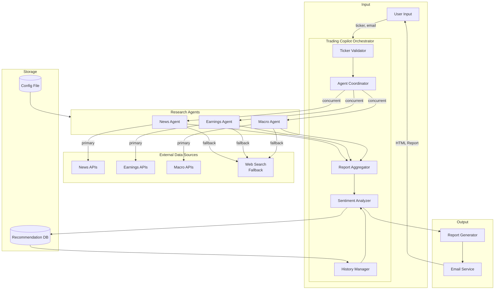
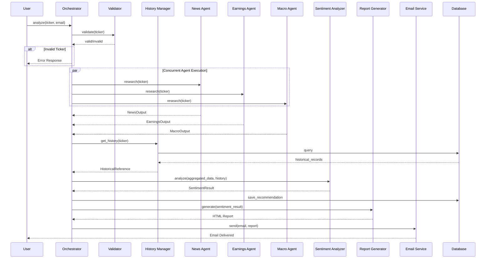
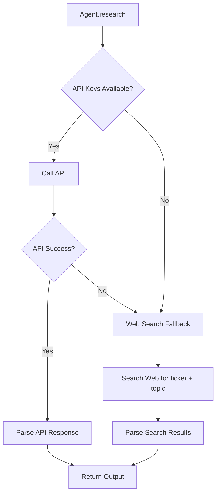

# Design Document: Trading Copilot

## Overview

The Trading Copilot is a multi-agent system that provides stock sentiment analysis by orchestrating specialized research agents. The system follows an agent-based architecture where a central orchestrator coordinates News, Earnings, and Macro agents to gather data concurrently, then synthesizes findings into a sentiment recommendation delivered via email.

The architecture prioritizes:
- **Modularity**: Each agent is independent and can be developed/tested in isolation
- **Resilience**: Partial failures don't block the entire pipeline
- **Extensibility**: New data sources and agents can be added via configuration
- **Traceability**: All recommendations are logged with full rationale for historical analysis

### Technology Stack

- **Language**: Python 3.11+ (excellent for data processing, rich ecosystem for financial APIs, strong async support)
- **Agent Framework**: AWS Strands Agents SDK for agent orchestration
- **LLM**: Claude (Anthropic) via Amazon Bedrock for sentiment analysis and summarization
- **Database**: SQLite for MVP (easily upgradeable to PostgreSQL)
- **Email**: SMTP with HTML templates (or Amazon SES for production)
- **Data Sources**: 
  - News: Alpha Vantage News API, Finnhub News
  - Earnings: Alpha Vantage Earnings, Financial Modeling Prep
  - Macro: FRED API (Federal Reserve Economic Data)

## Architecture



### Request Flow



## Components and Interfaces

### 1. Orchestrator (TradingCopilot)

The central coordinator that manages the entire analysis workflow.

```python
class TradingCopilot:
    """Main orchestrator for the trading analysis pipeline."""
    
    def __init__(self, config_path: str):
        """Initialize with path to data source configuration."""
        pass
    
    async def analyze(self, ticker: str, email: str) -> AnalysisResult:
        """
        Execute full analysis pipeline for a ticker.
        
        Args:
            ticker: Stock ticker symbol (e.g., "AAPL")
            email: Email address for report delivery
            
        Returns:
            AnalysisResult containing sentiment and metadata
            
        Raises:
            InvalidTickerError: If ticker validation fails
            ConfigurationError: If data sources are misconfigured
        """
        pass
    
    async def submit_feedback(self, recommendation_id: str, feedback: Feedback) -> None:
        """Record user feedback for a past recommendation."""
        pass
```

### 2. Ticker Validator

Validates stock ticker symbols against known exchanges.

```python
class TickerValidator:
    """Validates and normalizes stock ticker symbols."""
    
    def validate(self, ticker: str) -> ValidationResult:
        """
        Validate ticker against NYSE/NASDAQ listings.
        
        Args:
            ticker: Raw ticker input
            
        Returns:
            ValidationResult with normalized ticker or error details
        """
        pass
    
    def normalize(self, ticker: str) -> str:
        """Convert ticker to uppercase standard format."""
        pass
```

### 3. Research Agents

Base interface and specialized implementations for each research domain.

#### Data Source Strategy

Each agent implements a fallback strategy for data retrieval:

1. **Primary**: Use configured API sources (Alpha Vantage, Finnhub, FRED, etc.)
2. **Fallback**: If API keys are unavailable or API calls fail, use web search to gather information



#### Web Search Fallback

When API keys are not configured or API calls fail, agents fall back to web search:

- **NewsAgent**: Searches for `"{ticker} stock news"` and parses results
- **EarningsAgent**: Searches for `"{ticker} earnings report Q{quarter}"` and `"{ticker} earnings call transcript"`
- **MacroAgent**: Searches for `"{ticker} sector analysis"` and `"{ticker} macro factors"`

The web search results are processed by Claude to extract structured data matching the expected output format.

```python
from abc import ABC, abstractmethod

class ResearchAgent(ABC):
    """Base class for all research agents."""
    
    def __init__(self, config: DataSourceConfig):
        """Initialize with data source configuration."""
        pass
    
    @abstractmethod
    async def research(self, ticker: str) -> ResearchOutput:
        """
        Execute research for the given ticker.
        
        Uses API sources if available, falls back to web search otherwise.
        
        Args:
            ticker: Validated stock ticker
            
        Returns:
            ResearchOutput with findings and metadata
        """
        pass
    
    @abstractmethod
    def get_agent_type(self) -> AgentType:
        """Return the type of this agent."""
        pass
    
    def _has_api_keys(self) -> bool:
        """Check if required API keys are configured."""
        pass
    
    async def _web_search_fallback(self, ticker: str, query: str) -> list[dict]:
        """
        Perform web search as fallback when APIs unavailable.
        
        Args:
            ticker: Stock ticker symbol
            query: Search query string
            
        Returns:
            List of search result dictionaries
        """
        pass
    
    def _parse_web_results(self, results: list[dict]) -> ResearchOutput:
        """Parse web search results into structured output using Claude."""
        pass


class NewsAgent(ResearchAgent):
    """Gathers and analyzes market news."""
    
    async def research(self, ticker: str) -> NewsOutput:
        """
        Retrieve news articles from past 14 days.
        
        Falls back to web search if API keys unavailable.
        """
        pass
    
    async def _research_via_api(self, ticker: str) -> NewsOutput:
        """Fetch news using configured API sources."""
        pass
    
    async def _research_via_web_search(self, ticker: str) -> NewsOutput:
        """Fetch news using web search fallback."""
        pass
    
    def categorize_sentiment(self, article: NewsArticle) -> ArticleSentiment:
        """Classify article as positive, negative, or neutral."""
        pass
    
    def deduplicate(self, articles: list[NewsArticle]) -> list[NewsArticle]:
        """Remove duplicate or substantially similar articles."""
        pass


class EarningsAgent(ResearchAgent):
    """Analyzes company earnings data."""
    
    async def research(self, ticker: str) -> EarningsOutput:
        """
        Retrieve most recent earnings call data.
        
        Falls back to web search if API keys unavailable.
        """
        pass
    
    async def _research_via_api(self, ticker: str) -> EarningsOutput:
        """Fetch earnings using configured API sources."""
        pass
    
    async def _research_via_web_search(self, ticker: str) -> EarningsOutput:
        """Fetch earnings using web search fallback."""
        pass
    
    def compare_to_expectations(self, actual: EarningsData, expected: AnalystExpectations) -> EarningsComparison:
        """Determine if earnings beat/miss/met expectations."""
        pass


class MacroAgent(ResearchAgent):
    """Analyzes macro-economic trends."""
    
    async def research(self, ticker: str) -> MacroOutput:
        """
        Analyze macro factors relevant to ticker's sector.
        
        Falls back to web search if API keys unavailable.
        """
        pass
    
    async def _research_via_api(self, ticker: str) -> MacroOutput:
        """Fetch macro data using configured API sources."""
        pass
    
    async def _research_via_web_search(self, ticker: str) -> MacroOutput:
        """Fetch macro data using web search fallback."""
        pass
    
    def identify_sector(self, ticker: str) -> Sector:
        """Determine the sector for macro analysis context."""
        pass
```

### 4. Sentiment Analyzer

Synthesizes all research into a final sentiment recommendation using Claude via Bedrock.

```python
class SentimentAnalyzer:
    """Analyzes aggregated research to produce sentiment using Claude."""
    
    def __init__(self, bedrock_client: BedrockClient):
        """Initialize with Bedrock client for Claude access."""
        pass
    
    def analyze(
        self, 
        aggregated: AggregatedReport, 
        history: HistoricalReference | None
    ) -> SentimentResult:
        """
        Produce sentiment analysis from aggregated data.
        
        Args:
            aggregated: Combined output from all agents
            history: Past recommendations for context (optional)
            
        Returns:
            SentimentResult with classification and rationale
        """
        pass
    
    def calculate_confidence(
        self, 
        signals: list[Signal], 
        history_accuracy: float | None
    ) -> ConfidenceLevel:
        """Determine confidence level based on signal alignment and history."""
        pass
```

### 5. Report Generator

Creates HTML reports from analysis results.

```python
class ReportGenerator:
    """Generates HTML reports from analysis results."""
    
    def generate(self, result: SentimentResult, history: HistoricalReference | None) -> str:
        """
        Generate HTML report.
        
        Args:
            result: Complete sentiment analysis result
            history: Historical recommendations to include
            
        Returns:
            HTML string for email delivery
        """
        pass
    
    def render_executive_summary(self, result: SentimentResult) -> str:
        """Render the executive summary section."""
        pass
    
    def render_section(self, section: ReportSection) -> str:
        """Render a single report section."""
        pass
```

### 6. Email Service

Handles email delivery of reports.

```python
class EmailService:
    """Sends HTML reports via email."""
    
    def __init__(self, smtp_config: SMTPConfig):
        """Initialize with SMTP configuration."""
        pass
    
    async def send(self, to_email: str, subject: str, html_content: str) -> DeliveryResult:
        """
        Send HTML email.
        
        Args:
            to_email: Recipient email address
            subject: Email subject line
            html_content: HTML report content
            
        Returns:
            DeliveryResult with status and message ID
        """
        pass
```

### 7. History Manager

Manages recommendation history and feedback.

```python
class HistoryManager:
    """Manages recommendation history and feedback."""
    
    def __init__(self, db_path: str):
        """Initialize with database path."""
        pass
    
    def save_recommendation(self, recommendation: Recommendation) -> str:
        """
        Save recommendation to database.
        
        Args:
            recommendation: Complete recommendation record
            
        Returns:
            Recommendation ID
        """
        pass
    
    def get_history(self, ticker: str, limit: int = 10) -> HistoricalReference:
        """
        Retrieve past recommendations for a ticker.
        
        Args:
            ticker: Stock ticker to query
            limit: Maximum records to return
            
        Returns:
            HistoricalReference with past recommendations
        """
        pass
    
    def add_feedback(self, recommendation_id: str, feedback: Feedback) -> None:
        """Associate feedback with a recommendation."""
        pass
    
    def calculate_accuracy(self, ticker: str) -> float | None:
        """Calculate historical accuracy for a ticker based on feedback."""
        pass
```

### 8. Configuration Manager

Loads and validates data source configuration.

```python
class ConfigManager:
    """Manages data source configuration."""
    
    def __init__(self, config_path: str):
        """Initialize with config file path."""
        pass
    
    def load(self) -> DataSourceConfig:
        """
        Load and validate configuration.
        
        Returns:
            Validated DataSourceConfig
            
        Raises:
            ConfigurationError: If config is invalid
        """
        pass
    
    def validate(self, config: dict) -> list[str]:
        """Return list of validation errors (empty if valid)."""
        pass
    
    def get_sources_for_agent(self, agent_type: AgentType) -> list[SourceConfig]:
        """Get configured data sources for an agent type."""
        pass
```

## Data Models

```python
from dataclasses import dataclass
from datetime import datetime
from enum import Enum
from typing import Optional


class Sentiment(Enum):
    BULLISH = "bullish"
    BEARISH = "bearish"


class ConfidenceLevel(Enum):
    HIGH = "high"
    MEDIUM = "medium"
    LOW = "low"


class AgentType(Enum):
    NEWS = "news"
    EARNINGS = "earnings"
    MACRO = "macro"


class ArticleSentiment(Enum):
    POSITIVE = "positive"
    NEGATIVE = "negative"
    NEUTRAL = "neutral"


class EarningsComparison(Enum):
    BEAT = "beat"
    MISS = "miss"
    MEET = "meet"


@dataclass
class ValidationResult:
    is_valid: bool
    normalized_ticker: str | None
    error_message: str | None


@dataclass
class NewsArticle:
    headline: str
    source: str
    published_at: datetime
    summary: str
    url: str
    sentiment: ArticleSentiment


@dataclass
class NewsOutput:
    ticker: str
    articles: list[NewsArticle]
    retrieved_at: datetime
    status: str  # "success", "partial", "no_data"
    data_source: str = "api"  # "api" or "web_search"
    error_message: str | None = None


@dataclass
class EarningsData:
    fiscal_quarter: str
    revenue: float
    eps: float
    guidance: str | None
    management_commentary: str | None
    report_date: datetime


@dataclass
class AnalystExpectations:
    expected_revenue: float
    expected_eps: float


@dataclass
class EarningsOutput:
    ticker: str
    earnings: EarningsData | None
    expectations: AnalystExpectations | None
    comparison: EarningsComparison | None
    retrieved_at: datetime
    status: str
    data_source: str = "api"  # "api" or "web_search"
    error_message: str | None = None


@dataclass
class MacroFactor:
    category: str  # "geopolitical", "interest_rates", "supply_chain", "trade"
    description: str
    impact: str  # "positive", "negative", "neutral"
    relevance: str  # Why this matters for the ticker


@dataclass
class MacroOutput:
    ticker: str
    sector: str
    factors: list[MacroFactor]
    risks: list[str]
    opportunities: list[str]
    retrieved_at: datetime
    status: str
    data_source: str = "api"  # "api" or "web_search"
    error_message: str | None = None


@dataclass
class AggregatedReport:
    ticker: str
    news: NewsOutput
    earnings: EarningsOutput
    macro: MacroOutput
    aggregated_at: datetime
    missing_components: list[AgentType]


@dataclass
class Signal:
    source: AgentType
    direction: Sentiment
    strength: float  # 0.0 to 1.0
    reasoning: str


@dataclass
class SentimentResult:
    ticker: str
    sentiment: Sentiment
    confidence: ConfidenceLevel
    signals: list[Signal]
    summary: str
    key_factors: list[str]
    risks: list[str]
    disclaimer: str
    analyzed_at: datetime
    aggregated_report: AggregatedReport


@dataclass
class HistoricalRecommendation:
    recommendation_id: str
    ticker: str
    sentiment: Sentiment
    confidence: ConfidenceLevel
    summary: str
    created_at: datetime
    feedback: Optional["Feedback"] = None


@dataclass
class HistoricalReference:
    ticker: str
    recommendations: list[HistoricalRecommendation]
    accuracy_rate: float | None  # Based on feedback
    is_first_analysis: bool


@dataclass
class Feedback:
    outcome: str  # "accurate", "inaccurate", "partially_accurate"
    actual_movement: str  # "up", "down", "flat"
    notes: str | None
    submitted_at: datetime


@dataclass
class Recommendation:
    ticker: str
    email: str
    sentiment_result: SentimentResult
    created_at: datetime


@dataclass
class SourceConfig:
    name: str
    api_endpoint: str
    api_key_env: str  # Environment variable name for API key
    added_at: datetime
    enabled: bool = True


@dataclass
class DataSourceConfig:
    news_sources: list[SourceConfig]
    earnings_sources: list[SourceConfig]
    macro_sources: list[SourceConfig]
    last_updated: datetime


@dataclass
class SMTPConfig:
    host: str
    port: int
    username: str
    password_env: str  # Environment variable name
    from_email: str
    use_tls: bool = True


@dataclass
class AnalysisResult:
    success: bool
    recommendation_id: str | None
    sentiment_result: SentimentResult | None
    error_message: str | None


@dataclass
class DeliveryResult:
    success: bool
    message_id: str | None
    error_message: str | None
```


## Correctness Properties

*A property is a characteristic or behavior that should hold true across all valid executions of a system—essentially, a formal statement about what the system should do. Properties serve as the bridge between human-readable specifications and machine-verifiable correctness guarantees.*

### Property 1: Ticker Normalization

*For any* ticker string input, the normalized output SHALL be the uppercase version of the input string.

**Validates: Requirements 1.4**

### Property 2: Invalid Ticker Error Handling

*For any* string that is not a valid NYSE or NASDAQ ticker symbol, the system SHALL return a ValidationResult with `is_valid=False` and a non-empty `error_message`.

**Validates: Requirements 1.2**

### Property 3: News Article Completeness

*For any* NewsArticle in the output, it SHALL contain non-empty values for headline, source, published_at, and summary fields.

**Validates: Requirements 2.2**

### Property 4: News Deduplication

*For any* list of news articles processed by the deduplication function, the output list SHALL have no two articles with identical headlines, and the output length SHALL be less than or equal to the input length.

**Validates: Requirements 2.4**

### Property 5: News Sentiment Classification

*For any* NewsArticle in the output, the sentiment field SHALL be one of: POSITIVE, NEGATIVE, or NEUTRAL.

**Validates: Requirements 2.5**

### Property 6: News Date Range

*For any* NewsArticle in the output, the published_at date SHALL be within the past 14 days from the retrieval timestamp.

**Validates: Requirements 2.1**

### Property 7: Earnings Data Completeness

*For any* EarningsOutput with status "success", the earnings field SHALL contain non-null values for fiscal_quarter, revenue, eps, and report_date.

**Validates: Requirements 3.2**

### Property 8: Earnings Comparison Validity

*For any* EarningsOutput with both earnings data and analyst expectations, the comparison field SHALL be one of: BEAT, MISS, or MEET.

**Validates: Requirements 3.3**

### Property 9: Agent Failure Isolation

*For any* agent that fails during execution, the other agents SHALL complete their execution, and the AggregatedReport SHALL list the failed agent in missing_components while containing results from successful agents.

**Validates: Requirements 3.5, 5.3**

### Property 10: Macro Analysis Completeness

*For any* MacroOutput with status "success", it SHALL contain a non-empty sector, at least one MacroFactor, and non-empty risks and opportunities lists.

**Validates: Requirements 4.1, 4.5**

### Property 11: Aggregation Completeness

*For any* AggregatedReport, it SHALL contain the ticker, outputs from all successful agents with their retrieved_at timestamps preserved, and an aggregated_at timestamp.

**Validates: Requirements 5.1, 5.4, 5.5**

### Property 12: Sentiment Result Completeness

*For any* SentimentResult, it SHALL contain: a sentiment value of BULLISH or BEARISH, a confidence level of HIGH/MEDIUM/LOW, a non-empty summary, a non-empty key_factors list, a risks list, and a disclaimer containing "not financial advice".

**Validates: Requirements 6.1, 6.2, 6.3, 6.4, 6.5, 6.6**

### Property 13: Report Structure

*For any* generated HTML report, it SHALL contain an executive summary section appearing before detailed sections, and SHALL be valid HTML with distinct section elements.

**Validates: Requirements 7.1, 7.2, 7.3**

### Property 14: Report Error Indication

*For any* report generated from an AggregatedReport with non-empty missing_components, the HTML output SHALL contain visible indicators for each missing component.

**Validates: Requirements 7.5**

### Property 15: Config Validation

*For any* DataSourceConfig, it SHALL be parseable from the config file, and each SourceConfig SHALL contain non-empty api_endpoint, api_key_env, and added_at fields. Invalid configs SHALL produce validation errors.

**Validates: Requirements 8.1, 8.2, 8.5**

### Property 16: Config Source Round-Trip

*For any* data source added to the config and then removed, the system SHALL use the source while present and exclude it after removal, without requiring code changes.

**Validates: Requirements 8.3, 8.4**

### Property 17: Recommendation Storage Completeness

*For any* recommendation saved to the database, querying by its ID SHALL return the complete record including ticker, sentiment_result, and the full aggregated_report.

**Validates: Requirements 9.1, 9.2**

### Property 18: Feedback Association

*For any* feedback submitted for a recommendation_id, querying that recommendation SHALL return the associated feedback with outcome, actual_movement, and submitted_at.

**Validates: Requirements 9.3**

### Property 19: History Query Correctness

*For any* set of recommendations stored for a ticker within a date range, querying by that ticker and date range SHALL return exactly those recommendations.

**Validates: Requirements 9.4**

### Property 20: Database Failure Resilience

*For any* database write failure during recommendation storage, the system SHALL log the error and still deliver the email report successfully.

**Validates: Requirements 9.5**

### Property 21: Historical Reference Inclusion

*For any* ticker with existing recommendations in the database, the generated report SHALL include a HistoricalReference section containing past sentiment, date, and feedback for each historical recommendation.

**Validates: Requirements 10.1, 10.2, 10.3**

### Property 22: History Affects Confidence

*For any* ticker with historical recommendations that have accuracy feedback, the confidence calculation SHALL factor in the historical accuracy rate.

**Validates: Requirements 10.4**

### Property 23: First Analysis Indicator

*For any* ticker with no historical recommendations, the HistoricalReference SHALL have is_first_analysis=True.

**Validates: Requirements 10.5**

### Property 24: Web Search Fallback

*For any* agent where API keys are not configured or API calls fail, the agent SHALL fall back to web search and return a valid output with the same structure as API-sourced data. The output status SHALL indicate the data source used ("api" or "web_search").

**Validates: Requirements 2.1, 3.1, 4.1**

## Error Handling

### Input Validation Errors

| Error | Cause | Handling |
|-------|-------|----------|
| `InvalidTickerError` | Ticker not found in NYSE/NASDAQ | Return ValidationResult with error message, do not proceed |
| `EmptyTickerError` | Empty or whitespace-only input | Return immediate error, no API calls |
| `InvalidEmailError` | Malformed email address | Return error before starting research |

### Data Source Errors

| Error | Cause | Handling |
|-------|-------|----------|
| `APIConnectionError` | Network failure to data source | Retry with exponential backoff (3 attempts), then fall back to web search |
| `APIRateLimitError` | Rate limit exceeded | Wait and retry, fall back to web search if retries exhausted |
| `APIAuthenticationError` | Invalid or missing API credentials | Fall back to web search immediately |
| `APIKeyMissingError` | API key environment variable not set | Fall back to web search immediately |
| `DataParseError` | Unexpected API response format | Log raw response, fall back to web search |
| `WebSearchError` | Web search failed | Log error, mark agent as failed, continue with other agents |

### Agent Errors

| Error | Cause | Handling |
|-------|-------|----------|
| `AgentTimeoutError` | Agent exceeds time limit (30s) | Cancel agent, mark as failed, continue with others |
| `AgentExecutionError` | Unhandled exception in agent | Log stack trace, mark as failed, continue with others |

### Database Errors

| Error | Cause | Handling |
|-------|-------|----------|
| `DatabaseConnectionError` | Cannot connect to SQLite | Log error, continue with report delivery |
| `DatabaseWriteError` | Failed to save recommendation | Log error, continue with report delivery |
| `DatabaseQueryError` | Failed to query history | Log error, proceed without historical reference |

### Email Errors

| Error | Cause | Handling |
|-------|-------|----------|
| `SMTPConnectionError` | Cannot connect to mail server | Retry 3 times, then return error to user |
| `EmailDeliveryError` | Email rejected by server | Log error, return failure status with details |

### Error Response Strategy

1. **Graceful Degradation**: System continues with available data when individual components fail
2. **Transparent Reporting**: All errors are reflected in the final report with clear indicators
3. **Logging**: All errors logged with context for debugging
4. **No Silent Failures**: User always receives feedback about what succeeded and what failed

## Testing Strategy

### Dual Testing Approach

The Trading Copilot uses both unit tests and property-based tests for comprehensive coverage:

- **Unit tests**: Verify specific examples, edge cases, integration points, and error conditions
- **Property tests**: Verify universal properties across randomly generated inputs

### Property-Based Testing Configuration

- **Library**: Hypothesis (Python's leading PBT library)
- **Minimum iterations**: 100 per property test
- **Tag format**: `# Feature: trading-copilot, Property {N}: {property_text}`

### Test Categories

#### Unit Tests

1. **Ticker Validation**
   - Known valid tickers (AAPL, GOOGL, MSFT)
   - Known invalid tickers (XXXXX, 12345)
   - Edge cases (empty string, special characters)

2. **Agent Integration**
   - Mock API responses for each agent
   - Timeout handling
   - Malformed response handling

3. **Report Generation**
   - HTML structure validation
   - Section ordering
   - Mobile responsiveness (CSS validation)

4. **Email Delivery**
   - SMTP connection mocking
   - Delivery confirmation handling

5. **Database Operations**
   - CRUD operations for recommendations
   - Query by ticker and date range
   - Feedback association

#### Property Tests

Each correctness property (1-23) will have a corresponding property-based test:

```python
from hypothesis import given, strategies as st, settings

# Feature: trading-copilot, Property 1: Ticker Normalization
@given(ticker=st.text(min_size=1, max_size=10))
@settings(max_examples=100)
def test_ticker_normalization(ticker):
    result = normalize_ticker(ticker)
    assert result == ticker.upper()

# Feature: trading-copilot, Property 4: News Deduplication
@given(articles=st.lists(st.builds(NewsArticle, ...)))
@settings(max_examples=100)
def test_news_deduplication(articles):
    result = deduplicate(articles)
    headlines = [a.headline for a in result]
    assert len(headlines) == len(set(headlines))  # No duplicates
    assert len(result) <= len(articles)

# Feature: trading-copilot, Property 12: Sentiment Result Completeness
@given(report=st.builds(AggregatedReport, ...))
@settings(max_examples=100)
def test_sentiment_result_completeness(report):
    result = analyze_sentiment(report)
    assert result.sentiment in [Sentiment.BULLISH, Sentiment.BEARISH]
    assert result.confidence in [ConfidenceLevel.HIGH, ConfidenceLevel.MEDIUM, ConfidenceLevel.LOW]
    assert len(result.summary) > 0
    assert len(result.key_factors) > 0
    assert "not financial advice" in result.disclaimer.lower()
```

### Test Data Generation

- **Tickers**: Generate random uppercase strings, mix of valid/invalid
- **News Articles**: Generate with random headlines, dates within/outside 14-day window
- **Earnings Data**: Generate with random financial figures, various comparison scenarios
- **Macro Factors**: Generate with random categories and impacts
- **Historical Data**: Generate recommendation histories with various feedback patterns

### Integration Testing

1. **End-to-End Flow**: Test complete pipeline with mocked external APIs
2. **Concurrent Agent Execution**: Verify agents run in parallel
3. **Failure Scenarios**: Test various combinations of agent failures
4. **Database Persistence**: Verify data survives application restart

### Test Environment

- **Mocking**: Use `unittest.mock` for external API calls
- **Database**: Use in-memory SQLite for fast test execution
- **Email**: Use mock SMTP server (e.g., `aiosmtpd`)
- **CI Integration**: Run all tests on every commit
